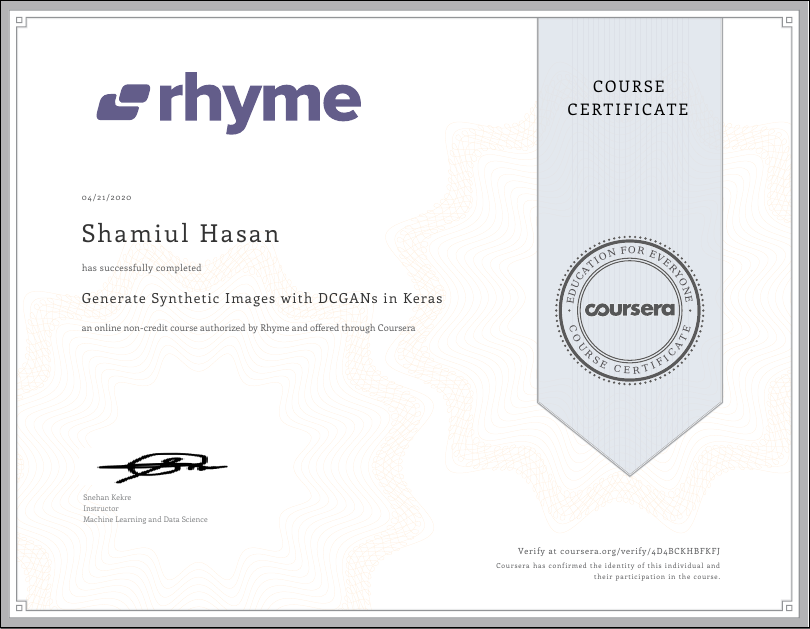

# Generate Synthetic Images with DCGANs in Keras by Coursera

## Course Introduction
I have always been interested in the usage of deep learning algorithms in image generation or classification. Definitely I had to take a shot at GAN. Coursera paved the way. 

I completed the ["Generate Synthetic Images with DCGANs in Keras"](https://www.coursera.org/projects/generative-adversarial-networks-keras) project on Coursera.  In this hands-on project, I learnt about Generative Adversarial Networks (GANs) and I built and trained a Deep Convolutional GAN (DCGAN) with Keras to generate images of fashionable clothes.  I used the Keras Sequential API with Tensorflow 2 as the backend.

## Certificate
I was genuinely happy to see this image. Feeling cute, might delete later. 

I will continue doing more projects on CNN, RNN, GAN and other Deep Learning projects. 
